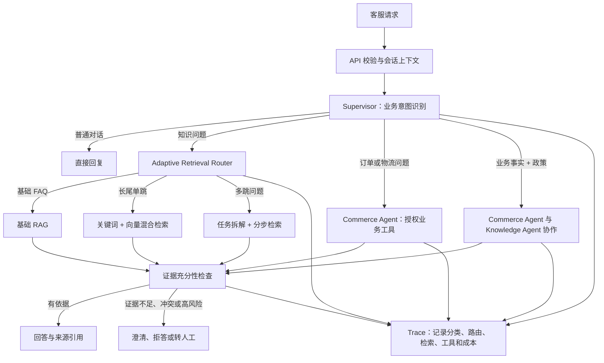

# CommerceCare 电商客服项目路线方案

> 本文是项目从初版到简历交付版的完整学习与实施路线。按用户的学习偏好，每阶段先讲目标、设计和代码，再由用户亲自编写；未经用户明确要求，不直接修改业务源代码。

**目标：** 构建一个基于 Adaptive-RAG 思路的 Java 电商客服 Copilot，针对长尾 FAQ 命中率低、多跳问题回答不稳和缺少证据时容易幻觉等问题，动态选择检索策略，并通过业务工具、安全兜底、评测和链路追踪控制回答质量。

**架构：** 在 D:\电商客服Agent 从零创建独立 Java 后端，采用模块化单体与 Spring AI Alibaba Graph 状态流程。Supervisor 识别业务意图，Knowledge Agent 选择并执行检索策略，Commerce Agent 查询业务工具；Graph 用条件边控制检索、证据检查、补充查询和人工接管。

**技术栈：** Java 21、Maven、Spring Boot 3.5 系列、Spring AI 1.1.2、Spring AI Alibaba 1.1.2.2 的 Graph 与 Agent Framework、DeepSeek Chat、独立的中文 Embedding 服务、PostgreSQL + pgvector、Apache Lucene BM25、Spring Data JDBC、Flyway、Docker Compose。Embedding 候选为 BGE-M3，重排候选为 bge-reranker-v2-m3，按阶段接入并通过项目问题集评测。

---

## 1. 项目定位与成功标准

### 1.1 项目定位

工作名：**CommerceCare — 面向长尾售后问题的自适应电商客服系统**。

目标用户是电商消费者与客服人员。系统先覆盖商品 FAQ、退换货政策、配送说明、订单/物流查询和售后工单草稿。核心价值是根据问题选择合适的知识检索深度，并能说明答案来自哪些业务数据或知识片段。

### 1.2 要解决的问题

1. 用户使用口语、别名、错别字或组合条件表达问题，单一向量检索容易漏掉知识。
2. 多跳问题需要关联订单状态、时间条件和售后政策，固定的一次检索与生成流程处理能力有限。
3. 资料缺失、过期或冲突时，模型可能生成没有依据的答案。
4. 固定使用最复杂 Agent 流程会增加延迟、Token 成本和失败点。
5. 没有评测集和调用轨迹时，无法判断改动改善了哪类问题。

### 1.3 成功标准

项目是否成功以自建问题集上的对照实验判断，不预设或沿用文章中的效果数字。最少需要回答：

- 自适应路由是否改善了长尾、多跳问题的端到端正确率？
- 混合检索、RRF、Rerank、Query Rewrite 分别带来什么变化？
- 无答案问题是否能可靠拒答或转人工？
- 相比固定流程，新增延迟和模型成本是多少？

## 2. 从零建立独立后端与框架选型

项目根目录为 **D:\电商客服Agent**。根目录 pom.xml 是 Maven 聚合工程，backend/pom.xml 是独立 Spring Boot 子模块，artifactId 为 commercecare，根包为 com.lzq.commercecare。启动类、模型配置、数据库配置、RAG 流程和 Agent 编排都在 backend 中建立。IDEA 从根目录导入父 POM 后，可通过共享 Maven 运行配置启动 backend。最终接口支持结构化 JSON 和按阶段推送的 SSE。

### 2.1 推荐框架组合与选择理由

| 职责 | 推荐组件 | 对本项目的作用 | 接入阶段 |
|---|---|---|---|
| 运行环境与构建 | Java 21 LTS、Maven Wrapper | Java 后端开发基础，固定可复现的构建方式 | 阶段 0 |
| HTTP 与应用容器 | Spring Boot、Spring MVC、Bean Validation | 文档上传、聊天 API、参数校验、SSE 与统一异常 | 阶段 0–1 |
| 模型、向量与工具适配 | Spring AI | ChatModel、EmbeddingModel、VectorStore、ToolCallback 的统一接口 | 阶段 1 |
| 自适应 RAG 流程 | Spring AI Alibaba Graph | 用节点、条件边与状态表达单跳、多跳、证据检查及有限循环 | 阶段 3 |
| 多智能体与自主工具执行 | Spring AI Alibaba Agent Framework | Supervisor/专家协作；ReactAgent 支持受控工具循环 | 阶段 4 |
| 业务与文档持久化 | PostgreSQL、Spring Data JDBC、Flyway | 订单、工单、知识版本、索引任务、评测和 Trace 数据 | 阶段 0–1 |
| 向量检索 | pgvector | 语义召回与文档元数据过滤 | 阶段 1 |
| 关键词检索 | Apache Lucene BM25 | 精确术语、产品型号与中文关键词召回；中文分词和实体字段单独配置 | 阶段 2 |
| 文本生成与路由 | DeepSeek Chat，通过 Spring AI ChatModel 接入 | 分类、改写、任务分解和有证据的回答 | 阶段 1 |
| 中文向量化与重排 | 独立 Embedding HTTP 服务、BGE-M3 候选；bge-reranker-v2-m3 候选 | 对中文 FAQ 做模型选型与召回/排序消融 | 阶段 1–2 |
| 可观测性 | Actuator、Micrometer、结构化 Trace | 节点耗时、Token、工具调用、失败原因和阶段指标 | 初期建立，阶段 6 完善 |
| 本地部署 | Docker Compose | PostgreSQL/pgvector 与服务配置的可复现环境 | 阶段 0 |

推荐以 **Spring Boot + Spring AI + Spring AI Alibaba Graph/Agent Framework** 作为最终框架组合。Spring AI 负责模型与检索适配，Graph 负责可检查的流程控制，Agent Framework 负责需要自主选择工具的专家。基础 RAG 可以先用普通服务实现，后续包装为 Graph 节点；每一个流程节点不必都是一次 Agent 调用。

### 2.2 其他框架路线比较

| 路线 | 优势 | 对本项目的取舍 |
|---|---|---|
| Spring AI + 手写 Java Workflow | 初版依赖少，固定 RAG 容易理解 | 可作为阶段 1 基线；最终的状态恢复、循环和编排由 Graph 承载 |
| Spring AI Alibaba Graph + Agent Framework | Java 生态内支持状态流程、多 Agent、检查点与人工介入 | 本项目推荐路线，适合自适应检索与售后处理的演进 |
| Python FastAPI + LangGraph + 检索组件 | 与文章的 Python 状态机方案接近 | 可以参考节点设计；当前学习目标以 Java 后端为主，选择 Java 框架实施 |

### 2.3 版本基线与兼容关系

2026-10-04 查询官方资料后，选定 Spring AI Alibaba **1.1.2.2 正式版**系列作为设计基线，配套 Spring AI **1.1.2** 与 Spring Boot **3.5.x**。官方 v1.1.2.2 的源码 POM 使用 Spring Boot 3.5.8；Spring Boot 3.5 文档当前列出维护版本 3.5.16，因此新工程建议固定到 3.5.16，并在首次搭建时核对 effective POM、依赖树和启动结果。截至 2026-10-04，基础后端已通过 Maven verify 编译打包与真实 JAR 的两个 HTTP 接口验证。当前只导入 AI 版本 BOM；Graph/Agent 实际依赖的运行兼容性在阶段 3–4 接入时验证。

Spring AI Alibaba 的 2.0.0-M1.1 发布页标记为预发布，配套 Spring AI 2.0.0-M1 与 Spring Boot 4.0.0。最终选型依据 Agent/Graph 的正式版兼容链，不沿用此前学习项目的版本组合。使用官方 BOM 管理依赖；不要分别任意升级 Spring AI、Graph 与 Agent Framework。后续版本升级需要记录依赖变更并重跑已有流程与检索评测。

依据：[SAA 版本对应关系](https://java2ai.com/docs/versions/) · [SAA 正式版发布](https://github.com/alibaba/spring-ai-alibaba/releases/tag/v1.1.2.2) · [v1.1.2.2 源码 POM](https://github.com/alibaba/spring-ai-alibaba/blob/v1.1.2.2/pom.xml) · [Spring Boot 3.5 文档](https://docs.spring.io/spring-boot/3.5/reference/index.html)

### 2.4 模型服务与检索实现

DeepSeek Chat 接口用于文本生成与工具选择；Embedding 和 Rerank 分别通过独立接口提供。中文 FAQ 首选评测 BGE-M3 与 bge-reranker-v2-m3：前者支持多语言向量化，后者以 query–passage 对进行相关度重排。优先接入可用的托管/HTTP 推理服务，再根据硬件条件考虑本地部署；初版不把本地大模型下载与推理作为后端启动前提。BGE-M3 自部署需要额外的内存/算力预算，模型是否适合仍以本项目数据验证。

Embedding 的模型名称、版本和向量维度随知识索引保存。更换模型时创建新索引并重新向量化，避免在同一索引混用不同模型的向量。RRF 只融合两路排名，不直接把 BM25 分数与向量相似度相加；候选重排后进入证据打包步骤。

依据：[DeepSeek Chat 适配](https://docs.spring.io/spring-ai/reference/api/chat/deepseek-chat.html) · [BGE-M3 模型说明](https://github.com/FlagOpen/FlagEmbedding/blob/master/research/BGE_M3/README.md) · [BGE Reranker](https://github.com/FlagOpen/FlagEmbedding/blob/master/examples/inference/reranker/README.md) · [Lucene BM25](https://lucene.apache.org/core/9_12_3/core/org/apache/lucene/search/similarities/BM25Similarity.html)

### 2.5 Graph 与业务边界

Graph 状态保存本次请求的计划、子问题、证据、检索轮数、工具结果和执行状态。会话记忆保存跨请求的历史消息，两者分别定义生命周期。Graph 的检查点用于暂停和恢复流程；知识版本和订单事实继续从数据库/业务工具读取。检索次数、工具次数、总耗时和预算由确定性服务约束，模型输出只在允许的枚举与参数范围内生效。

推荐阶段 1 的基础依赖包含 Web、Validation、JDBC、Flyway、pgvector、Chat 与 Embedding 适配；到阶段 3–4 按需要加入 Graph 和 Agent Framework。整个项目采用一个 Spring Boot 后端，Redis、消息队列和微服务拆分根据后续实际需求增加。

## 3. 目标架构



### 3.1 两类路由必须分开

- **业务意图路由：** FAQ、订单物流、复合问题、普通对话、投诉/人工处理。
- **检索复杂度路由：** 仅对知识问题选择 `BASIC`、`HYBRID_SINGLE_HOP`、`MULTI_HOP`。

订单状态由业务数据库/API 提供；政策和 FAQ 由 RAG 提供。订单查询不能因为 Adaptive-RAG 选择“不检索知识库”而退化成让模型凭记忆回答。

### 3.2 多 Agent 职责

初版控制为三个角色，按需执行：

1. **Supervisor：** 输出业务意图、必要参数、计划类型和是否需要人工处理。
2. **Knowledge Agent：** 执行检索策略，整理带来源的知识证据。
3. **Commerce Agent：** 调用只读订单、物流和商品工具；将工具返回的结构化事实交给回答合成步骤。

工单状态迁移、退款、取消订单等副作用由确定性业务服务处理。初版只生成待确认工单，不执行真实退款或取消。普通 FAQ 不启动所有 Agent。

## 4. Adaptive-RAG 与回答策略

| 路径 | 适用问题 | 初版实现 | 结束条件 |
|---|---|---|---|
| `NO_KB_RETRIEVAL` | 寒暄、确认收到、非业务事实的普通对话 | 直接回复或澄清 | 不输出订单/政策等事实 |
| `BASIC_RAG` | 答案通常位于一个 FAQ 条目 | 单次向量检索、答案附来源 | 证据足够则回答，否则走兜底 |
| `HYBRID_SINGLE_HOP` | 长尾表达、专有名词、产品型号、单文档答案 | Query 规范化、BM25 + 向量召回、RRF、可选重排 | 证据足够则回答，否则进行一次补充查询或兜底 |
| `MULTI_HOP` | 需结合多个政策、多个条件或业务事实 | 结构化拆解子问题、分别检索、合并证据、限制最大检索轮数 | 所有关键子问题有来源，否则追问/转人工 |
| `BUSINESS_TOOL` | 订单、物流、库存等动态数据 | 授权业务工具查询 | 工具返回可信事实；超时/无权限进入明确错误或人工流程 |
| `OUT_OF_SCOPE` | 超出客服知识或业务边界 | 拒答或人工转接 | 附转接原因和对话摘要 |

### 4.1 三个容易混淆的概念

- **Adaptive-RAG：** 按问题复杂度在不同检索策略之间路由。
- **Self-RAG 风格的证据门：** 判断是否还需要检索、证据是否足够、回答是否受到证据支持。本项目先实现可解释的工程化证据检查，不宣称复现完整 Self-RAG 训练方法。
- **Agentic RAG：** Agent 在多步任务中决定使用知识检索、订单工具或其他工具。本项目把它用于确实需要工具/多步执行的请求，不用于所有 FAQ。

如果复杂度路由使用提示词或规则，项目描述应写“参考 Adaptive-RAG 的工程化路由”，只有真正训练并验证复杂度分类器后，才声称复现论文分类器方案。[Adaptive-RAG 论文](https://arxiv.org/abs/2403.14403) · [作者实现](https://github.com/starsuzi/Adaptive-RAG)

### 4.2 Query Rewrite 使用条件

不对每个问题都改写。只在口语表达含糊、对话上下文省略实体或首轮检索效果低时触发；必须保留原始问题、SKU/型号、订单编号、否定词和时间条件。改写结果也进入 Trace，以便发现模型改写丢失业务条件的情况。

## 5. 知识、数据库与业务数据

### 5.1 知识资料

首批知识资料限定为 FAQ、退换货策略、配送说明、商品使用说明。每份资料保存来源、类别、商品/品类、地区/渠道、版本、生效时间、更新时间与状态。检索结果必须保留文档 ID、片段 ID 和可展示引用。PostgreSQL 保存文档、片段和索引任务状态作为数据来源；向量索引与关键词索引使用同一片段 ID，支持失败任务重试和重建。

入库流程按阶段实现：文件上传 → 格式解析 → 清洗 → 按标题/语义边界切分 → 附加元数据 → Embedding → 写入向量存储 → 可检查解析和切片结果。更新资料时按文档版本重新切片并替换对应记录，避免旧规则继续被检索。

### 5.2 存储选择

目标选择 **PostgreSQL + pgvector**：中等规模项目可把客服业务表、评测记录和向量数据放在易部署维护的数据库体系中。需要用实际数据和过滤需求决定是否增加更专用的向量数据库；不因项目名气直接引入 Milvus。WeKnora 可用作模块设计与观测思路参考，但它使用 Go 技术栈，不直接复制其代码。[Tencent/WeKnora](https://github.com/Tencent/WeKnora)

新项目从阶段 1 使用 PostgreSQL + pgvector 建立持久化向量基线。混合检索阶段增加 Lucene 的真实 BM25 索引，以统一 chunkId 合并两路结果；PostgreSQL 自带全文检索不标注为 BM25。Lucene 索引写入 Docker 持久化卷，并可根据数据库中已发布的文档片段重建。向量与关键词索引均按相同的文档版本和元数据过滤，只有两路索引准备好后才发布该知识版本。

### 5.3 业务事实和副作用

- 订单、商品库存和物流状态来自受控工具/API，不以 RAG 片段作为实时数据源。
- 订单查询根据认证上下文确定当前用户；模型不能自行指定任意用户或访问其他用户订单。
- 高风险写入先生成待确认操作；服务端校验权限、业务状态和幂等键后再执行。
- MCP 可作为后续扩展边界；MVP 先使用本地 Spring 服务工具，避免把 MCP 启动和远程调用问题与 RAG 问题混在一起。

## 6. 评测与可观测性

### 6.1 问题集设计

先建立人工审核的小型黄金问题集，按类型覆盖：常见 FAQ、长尾单跳、多跳政策、订单+政策复合、无答案、过期/冲突资料、精确 SKU/型号、工具超时和越权查询。每条数据至少记录：

`caseId、question、intent、complexity、expectedStrategy、answerable、expectedEvidenceIds、expectedTool、goldAnswer、riskTag`

从 80–120 条人工检查用例起步，保证各类都有覆盖；测试集与调参用例分开。之后根据失败案例增加数据。这个数量只是初始工程规模，报告指标时同时标明样本量和标注方法。

### 6.2 指标

| 层次 | 指标 | 用途 |
|---|---|---|
| 意图/复杂度路由 | Macro-F1、混淆矩阵、各类 Recall | 看错分发生在哪一类问题 |
| 检索 | Precision@K、Recall@K、MRR；必要时 nDCG@K | 看证据是否召回及其排名 |
| 生成 | Answer Accuracy、Faithfulness、引用支持率、拒答准确率 | 看答案正确且是否有依据 |
| 业务 | 可回答问题解决率、误转人工率、无依据回答率、工具参数正确率 | 看客服价值和安全性 |
| 效率 | P50/P95 延迟、模型调用轮数、Token 与成本 | 看质量提升是否值得其开销 |

检索 Precision/Recall 不等于答案正确率；自动 LLM Judge 只能辅助，关键集合需人工核验。不得直接把参考文章中的数字写进自己的简历。

### 6.3 分阶段消融

依次比较：基础 RAG → 混合检索 → RRF → Rerank → 条件式 Query Rewrite → Adaptive 路由 → 多跳流程 → 证据门。每轮只改一个主要变量，在同一问题集上记录质量、延迟和成本。若某个步骤没有带来可测量收益，就保留更简单的方案。

### 6.4 Trace 字段

每次请求记录 `requestId、conversationId、意图、复杂度、策略、原始/改写 Query、检索轮数、文档/片段 ID、召回分数与排名、Rerank 分数、工具及耗时、证据检查结论、引用、拒答/追问/转人工原因、模型耗时、Token 用量和错误类型`。日志需隐藏密钥、手机号和地址等敏感信息。

## 7. 完整阶段路线

### 阶段 0：需求和评测基线

**产出：** 明确 API 业务范围、意图/复杂度标签、首批 FAQ 资料、黄金问题集字段和 Trace 字段。根目录保留 Maven 聚合 POM 与 IDEA 共享启动配置，在 backend/ 建立 Spring Boot 子模块；使用 com.lzq.commercecare 包名，固定依赖版本，并提供健康检查。PostgreSQL/pgvector 进入后续持久化阶段。

**完成标准：** 新后端可独立启动；依赖树符合选定的框架版本关系；健康检查与数据库连接可验证。每类请求有预期处理路径；每条评测用例有可核验的证据或明确标记为无答案；确定比较固定单轮 RAG 的基线方案。

### 阶段 1：基础 FAQ RAG

**实现：** 在新后端建立文档、片段与索引任务表；先支持 Markdown/TXT 资料，接入独立 Embedding 服务和 pgvector，完成单轮检索、Prompt 生成与引用来源。提供 POST /api/v1/chat 接口，使用请求/响应 DTO、参数校验、统一异常与 requestId；通过 Apifox 调用。PDF/Word 解析随后按资料需求扩展。

**完成标准：** 能说明每个答案使用了哪些资料；无相关资料时不把模型内部知识伪装成企业政策。

### 阶段 2：检索质量优化

**实现：** 增加 BM25 与向量混合召回、RRF、元数据过滤，再单独评估是否需要 Rerank 和 Query Rewrite。

**完成标准：** 有检索基线和逐项消融结果；可通过日志看到命中的片段与排序分数。

### 阶段 3：Adaptive 复杂度路由与多跳

**实现：** 使用 Spring AI Alibaba Graph 定义分类、单轮检索、问题拆解、证据检查、补充检索和回答节点，以条件边选择流程。检索节点调用项目自己的召回服务，基础 RAG 与自适应 RAG 共享同一套索引和评测集。每个请求限制检索轮数与子问题数，并记录节点级状态与耗时。

**完成标准：** 路由可追踪；多跳回答逐个子结论关联证据；证据不全会追问或兜底；与固定 RAG 用同一评测集对比。

### 阶段 4：客服多 Agent 与业务工具

**实现：** 在已有 Graph 流程中加入 Supervisor、Knowledge Agent、Commerce Agent；需要自主选择工具的业务专家使用 Spring AI Alibaba Agent Framework 的 ReactAgent。确定性检索节点保持普通 Java 服务。订单/物流/商品数据使用新建的模拟业务库与只读工具；复合请求合并业务事实和政策证据。

**完成标准：** 越权工具调用被拒绝；工具超时可定位；普通 FAQ 不启动不必要的 Agent；工单仅进入待确认状态。

### 阶段 5：证据门、转人工和会话流程

**实现：** 判断证据充分性、冲突和超范围；按触发原因澄清、拒答或创建人工工单草稿；保存会话与交接摘要。

**完成标准：** 支持回答、追问、拒答、转人工四种可观察结果；业务写操作有服务端校验和幂等保护。

### 阶段 6：可靠性与工程化交付

**实现：** 完善前期已使用的 PostgreSQL、pgvector、Flyway 与 Docker Compose；补齐索引任务恢复、知识版本发布、Graph 检查点存储、会话记忆持久化、认证与资源权限、限流/超时/降级、API 文档和 Actuator/Micrometer 指标。根据已测量的共享状态或并发需求决定是否增加 Redis。

**完成标准：** 全新环境按 README 可启动；重启后知识和业务数据仍在；模型或向量检索故障有明确降级响应。

### 阶段 7：评测报告与简历交付

**实现：** 固化离线评测入口、基线对比报告、失败案例集、架构图、Apifox/Swagger 示例、演示数据和简短演示界面（后端主线完成后再决定）。

**完成标准：** 每个简历数字可从评测报告复现；能讲清楚问题、方案取舍、坏例分析、效果变化和成本；没有真实外部接入的部分明确标记为模拟数据。

## 8. 新项目目录与代码模块边界

项目根目录和后端代码分开组织，按阶段新增目录：

```text
D:\电商客服Agent\
├── pom.xml                              # 根 Maven 聚合工程
├── .run/CommerceCare.run.xml            # IntelliJ IDEA 共享启动配置
├── README.md
├── 技术方案与项目路线.md
└── backend/                             # 独立 Spring Boot 子模块
│   ├── pom.xml
│   ├── mvnw 与 mvnw.cmd
│   ├── src/main/java/com/lzq/commercecare/
│   │   ├── CommerceCareApplication.java
│   │   ├── assistant/                   # 聊天 API、请求响应、应用编排
│   │   ├── routing/                     # 意图/复杂度标签与结构化分类
│   │   ├── workflow/                    # Graph 状态、节点、条件边与恢复
│   │   ├── agent/                       # Supervisor 与专家 Agent 配置
│   │   ├── knowledge/                   # 文档版本、解析、切分、索引任务
│   │   ├── retrieval/                   # 向量/BM25、RRF、重排与证据整理
│   │   ├── commerce/                    # 商品、订单、物流及授权查询工具
│   │   ├── handoff/                     # 澄清、转人工、审批与工单
│   │   ├── conversation/                # 会话与消息持久化
│   │   ├── evaluation/                  # 评测运行、指标和错误归因
│   │   ├── observability/               # Trace、脱敏与耗时/Token 指标
│   │   ├── security/                    # 身份与资源访问规则
│   │   └── config/                      # 模型、数据库及应用配置
│   └── src/main/resources/
│       ├── application.yml
│       └── db/migration/                # Flyway 迁移
├── datasets/                            # 演示知识与开发/测试问题集
├── docs/                                # 接口、评测报告与坏例分析
└── deploy/                              # Compose、配置样例与索引持久化卷
```

业务模块内放置自己的 controller、service、repository 和 DTO，避免把全部职责堆在一个通用 Service。Knowledge 模块管理数据入库，Retrieval 模块提供只读证据检索，Workflow 模块控制执行路径，Agent 模块只负责专家配置与自主工具流程。先建立一个 Maven 后端模块，随实际文件量演进。

## 9. 技术风险与边界

| 风险 | 处理方式 |
|---|---|
| 长尾问题的答案根本不在知识库 | 明确无答案，收集授权后的失败案例补充资料；不把复杂度路由当成知识覆盖 |
| 查询改写丢失型号、否定词、日期 | 保留原 Query，对实体字段结构化并检查改写前后关键字段 |
| 多跳检索无限循环 | 限制子问题数、检索轮次、工具次数、总耗时和 Token 预算 |
| 多 Agent 增加延迟且未提升质量 | 与单 Agent/固定 Workflow 做同集对照，收益不足则合并角色 |
| Self-RAG/Adaptive-RAG 名称被过度宣传 | 准确标注工程实现范围，不声称训练或复现未完成的论文方法 |
| 参考系统技术栈不一致 | WeKnora 用于架构阅读；项目实现仍保持 Java + Spring AI，不为追新随意切到 Go 或 Python 框架 |
| 指标样本太少或口径不清 | 报告样本量、标签规则、计算方式、版本和失败类型；不复制参考文章数字 |

## 10. 当前开始点与学习协作方式

截至2026-10-08，独立后端、基础FAQ RAG、BM25、RRF、一键分组评测与已知型号过滤已建立，当前处于阶段2检索质量优化。型号过滤的12项单元测试、两组336次检索对照、21项HTTP边界及30项型号清单检查通过；在当前开发集，7条组合题每路均找齐两份必要资料。详细口径与限制见[型号过滤对照验证报告](datasets/evaluation/expanded-v1/型号过滤对照验证报告.md)。

完整品牌型号的规则识别预览接口已实现；现已接入独立chat/routed入口，单一型号走过滤检索，其余状态澄清。项目43项测试在隔离副本通过，新入口16条开发用例字段检查通过；旧chat保留为无过滤基线。实测、构建限制和范围取舍见[聊天路由验证报告](datasets/evaluation/routed-chat-v1/验证报告.md)。这只是按型号状态分流，不是复杂度自适应策略选择。

阶段1的知识生命周期与统一追踪尚待补齐。Adaptive复杂度路由、依赖式多跳与多Agent仍未实现。下一步优先设计业务意图与任务范围路由，支持合理的多型号比较，再通过订单+有效政策案例评估依赖式多跳；不为既已解决的组合题强行增加拆解。此前阶段复盘与候选设计保留在[项目阶段复盘与下一步设计](docs/项目阶段复盘与下一步设计.md)。

所有开发文件属于这个独立项目。每个代码步骤先说明目标、设计、完整代码和知识点，由你自己写入；你明确要求我修改时，我再直接操作源文件。计划中的能力不记作已完成。

项目中期望使用的参考资料：

- [Adaptive-RAG 论文](https://arxiv.org/abs/2403.14403)：复杂度路由与无/单/多步检索的研究依据。
- [Adaptive-RAG 作者代码](https://github.com/starsuzi/Adaptive-RAG)：研究实现参考；Python/T5 训练部分不直接移植到 Spring 项目。
- [Spring AI Alibaba](https://github.com/alibaba/spring-ai-alibaba)：Java Graph 状态流程与多 Agent 的主要框架参考。
- [Spring AI Examples](https://github.com/spring-projects/spring-ai-examples)：Spring AI 工作流、工具调用和模式示例。
- [Tencent WeKnora](https://github.com/Tencent/WeKnora)：模块化知识平台、检索调试、Agent 与可观测性参考；用架构作对照，不复制 Go 代码。
